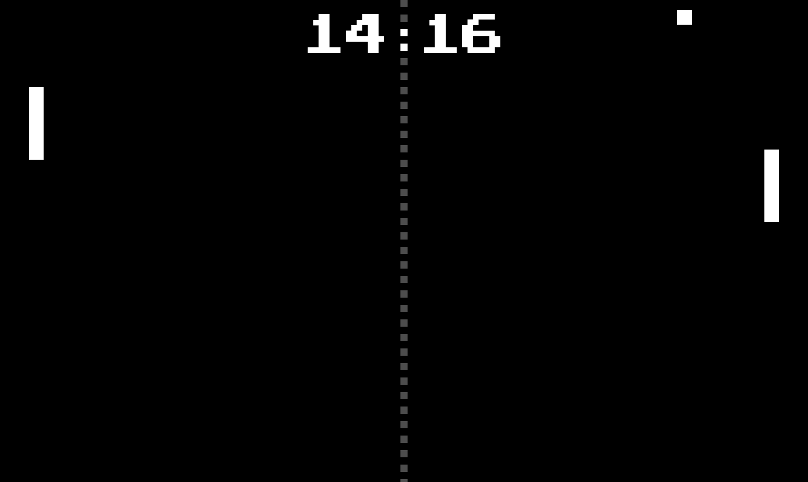
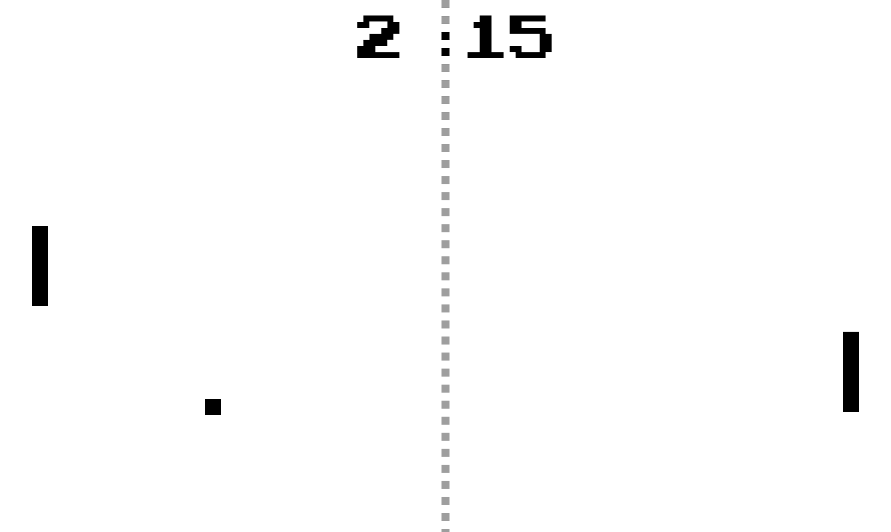

# Pong-Inspired Arcade Clock

This project began as an entry to the [Flutter Clock Challenge](https://flutter.dev/clock). Some features and fixes have been added after the contest concluded.

The hour and minute side play Pong. When the hour or minute changes, the corresponding side lets the ball pass and the "score" is updated to reflect the time.

Available in bright and dark modes as a 12 or 24 hour clock.